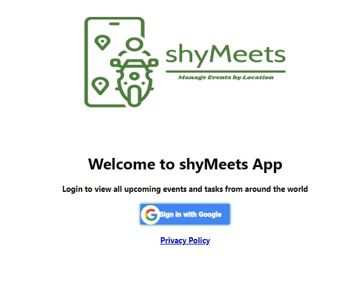
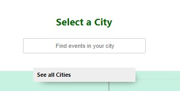
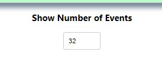
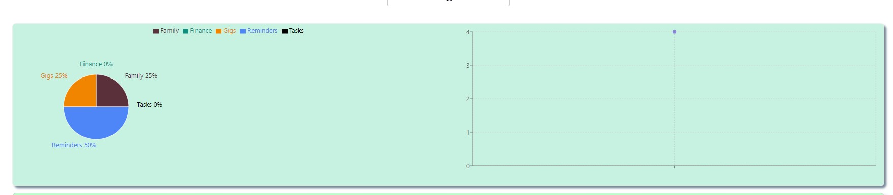
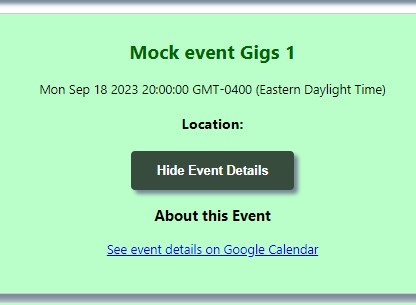

# shyMeets Overview:

shyMeets App is designed to help users manage all of their events that take place in various cities around the world. The app uses serverless functionality from Google OAuth, and Amazon AWS Lambda. This allows for maximum security for the user, while also performing key backend functions. This is a a PWA (Progressive Web App) which can easily be installed on the users mobile device, desktop, or in browser, regardless of the type of device (Apple vs Android...)

## Serverless Functionality:

The app uses Amazon AWS Lambda for performing key functions in the backend, such as performing verification functions like receiving access token, getting events and so on.
Google OAuth 2 is used as a basis for verifying users by their perspective Google accounts, allowing for added security, and not needing to create all the verifications functions that can be very time consuming.

## Technologies used in thi app:
-React
-JavaScript
-CSS
-HTML

Serverless function:
-AWS Lambda for setting backend function
-Google OAuth for authentication

## Installation instruction 

Note: This is designed to work on Google devices only
-Open chrome
-Go navigate to https://shayalieb.github.io/shyMeets/
-On the top right (by the vertical three dots)
-Click "More Tools
-Enter the name for the short cut and click create

# App Road map

##User is taken to the home page to sign in using Google OAuth 

##Once logged in the user will see a list of events 

##User can search events by city or all cities

##On the bottom of the page the user can select the number of events to show

##User can view a chart with the event type

##User show or hide event details, as well as a link to the actual Google calendar event

# User stories
## Scenario road map:
<ul>
    <li>As a [role] (Given)</li>
    <li>I should be able to [action] (When)</li>
    <li>So that [benefit] (Then)</li>
    </ul>
<ul>

